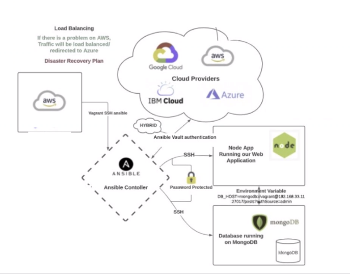

# Infrastructure as Code

### What is IaC?

- Infrastructure as Code (IaC) is the managing and provisioning of infrastructure through code instead of through manual processes.
- You can automate processes alot faster rather than manually completing them. 
- You can easily scale up the process as well

### Why is IaC useful?

- Cost reduction
- Increase in speed of deployments
- Reduce errors 
- Improve infrastructure consistency
- Eliminate configuration drift

### What is Configuration Management?

- Configuration management is the process of maintaining the desired state of computer systems, servers, applications, network devices, and other IT components. It's a method of ensuring that a system continues to perform as expected even after numerous changes are made over time. 

### What is Orchestration?

- The automated configuration, management, and coordination of computer systems, applications, and services is known as orchestration. Orchestration makes it easier for IT to manage complex tasks and workflows.

### IaC Diagram

Infrastructure currently on cloud (can be on premises as well), we can use Ansible Controller to SSH in VM to to make any updates. Ansible has a vault authentication that connect t the cloud providers to access login details.

### What is Ansible?

- Ansible is a Python-based open source command-line IT automation software programme. It is capable of configuring systems, deploying software, and orchestrating complex workflows to support application deployment, system updates, and other tasks.

### Ansible Vault

- With Ansible Vault, you can store sensitive information like passwords or keys in encrypted files as opposed to plaintext in playbooks or roles. The files from the vault can then be shared or added to source control.