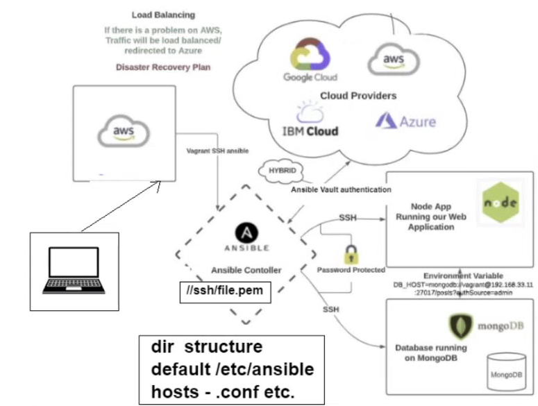
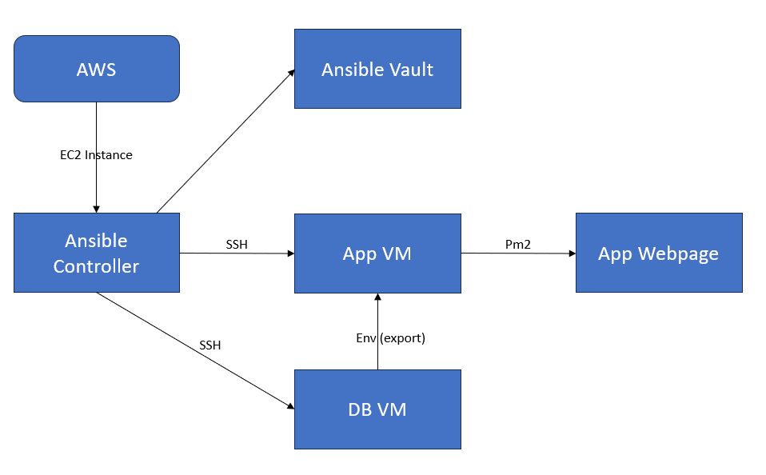

# Ansible

## Arcitectural Diagram





### What is Ansible?

- Ansible is a Python-based open source command-line IT automation software programme. It is capable of configuring systems, deploying software, and orchestrating complex workflows to support application deployment, system updates, and other tasks.
- More information: https://www.redhat.com/en/technologies/management/ansible/what-is-ansible

### Why use Ansible?

- Ansible can be used to provision your environment's underlying infrastructure, virtualized hosts, network devices, and bare metal servers. It can also install services, add compute hosts, and provision cloud resources, services, and applications.

### Benefits of Ansible.

- Team impact
    - Save time and be more productive
    - Eliminate repetitive tasks
    - Fewer mistakes & errors
    - Improve collaboration and job satisfaction
- Enterprise Impact
    - Overcome complexity
    - More resources for innovation
    - Increase accountability and compliance

### Disadvantages of Ansible.

- Insufficient User Interface
- Lack of any Notion of State
- Limited Windows Support
- Ansible is New to the Market

### What is Ansible Vault?

- With Ansible Vault, you can store sensitive information like passwords or keys in encrypted files as opposed to plaintext in playbooks or roles. The files from the vault can then be shared or added to source control.
- More information: https://docs.ansible.com/ansible/2.9/user_guide/vault.html#:~:text=Ansible%20Vault%20is%20a%20feature,or%20placed%20in%20source%20control.


### Ansible commands:
```
sudo ansible web -a "uname -a"
```
This command will run the command stated in "" inside the instance that is configured in group web
```
sudo ansible web -m ping
```
This command will ping back the response of instances contained in configuration group web


